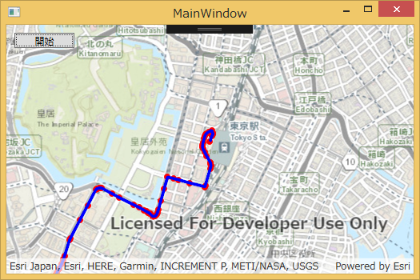

# サンプルの概要
ArcGIS Runtime SDK for .NET（WPF API）のローカル サーバー機能を使用して、ローカル ジオプロセシング サービスを作成、実行する方法を紹介するサンプル アプリケーションです。
このサンプルでは「ポイント → ライン (Points to Line)」ジオプロセシング ツールを使用します。



# 開発環境
* ArcGIS Runtime SDK for .NET バージョン 100.2.1

# ローカル サーバーを使用するための開発環境の準備

ArcGIS Runtime SDK for .NET の動作要件は[動作環境ページ](https://www.esrij.com/products/arcgis-runtime-sdk-for-dotnet/environments)をご参照ください。

ローカル サーバーを使用する場合は、上記要件に加えて以下の作業が必要です。

1. Microsoft Visual C++ 再頒布可能パッケージのインストール
 * Microsoft Visual C++ 2008 Redistributable Package (x86 または x64)
 * Microsoft Visual C++ 2010 Redistributable Package (x86 または x64)
 * Microsoft Visual C++ 2012 Redistributable Package (x86 または x64)
 * Microsoft Visual C++ 2013 Redistributable Package (x86 または x64)

1. [SDK のダウンロードページ](https://developers.arcgis.com/downloads/#arcgis-runtime-local-server)から ローカル サーバー用の SDK をダウンロードし、インストールします（ArcGIS for Developers の[開発者アカウント](http://esrijapan.github.io/arcgis-dev-resources/get-dev-account/)が必要です）。

1. Visual Studio のプロジェクトで、Esri.ArcGISRuntime.WPF とは別に ローカル サーバー用の NuGet パッケージ（Esri.ArcGISRuntime.LocalServices）も併せてインストールします（サンプル プロジェクトをそのまま実行する場合は、ビルド時に自動でインストールされます）。

1. 最初にローカル サーバーを使用するプロジェクトをビルドすると、プロジェクト ディレクトリに XML 形式のマニフェスト ファイル（ArcGISLocalServer.AGSDeployment）が作成されます。このマニフェスト ファイルではアプリケーションに配置するローカル サーバーのコンポーネントを定義します。本サンプルを実行する場合は、以下の様に編集して "Geoprocessing" パッケージを有効にします（サンプル プロジェクトをそのまま実行する場合は、既に作成・設定済みのためこの作業は不要です）。
```xml
 <Package name="Geoprocessing" enabled="true">
```

ローカル サーバーを使用するための開発環境に関する詳細は [ArcGIS Runtime SDK for .NET (WPF) :Local Server](https://developers.arcgis.com/net/latest/wpf/guide/local-server.htm) をご参照ください。


# ジオプロセシング パッケージの作成
ローカル ジオプロセシング サービスを作成するには、事前にジオプロセシング パッケージ（.gpk）を作成する必要があります。
サンプル コードでは、事前に作成済みの PointsToLine.gpk を使用していますが、自身で作成する場合は以下の手順で作成してください。

1. ArcMap を起動します
1. ArcMap で、「ポイント → ライン (Points to Line)」ジオプロセシング ツールを実行します
1. ジオプロセシング メニューの [結果] ウィンドウを開き、実行したツールを右クリックし、[共有] -> [ジオプロセシング パッケージ] を選択します
1. 「パッケージをファイルに保存」、「スキーマのみパッケージ」、「ArcGIS Runtime のサポート」をチェックします
※「ArcGIS Runtime のサポート」のチェックが表示されていない場合は、メニューの [カスタマイズ] -> [ArcMap オプション] -> [共有] で、「ArcGIS Runtime ツールの有効化」をチェックします
1. 「ポイント → ライン (Points to Line)」のタブを選択して、名前を「Points_To_Line」に変更します
1. [入力フィーチャ] パラメーターのタブを選択し、入力モードを「ユーザー定義値」に設定します
1. 右上の [共有] ボタンをクリックして、.gpk ファイルを保存します
